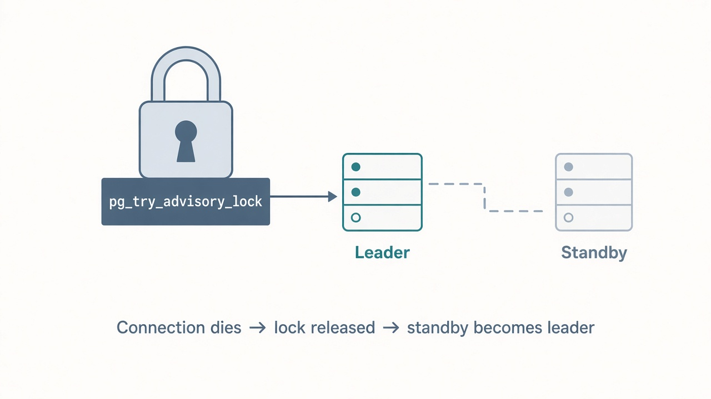
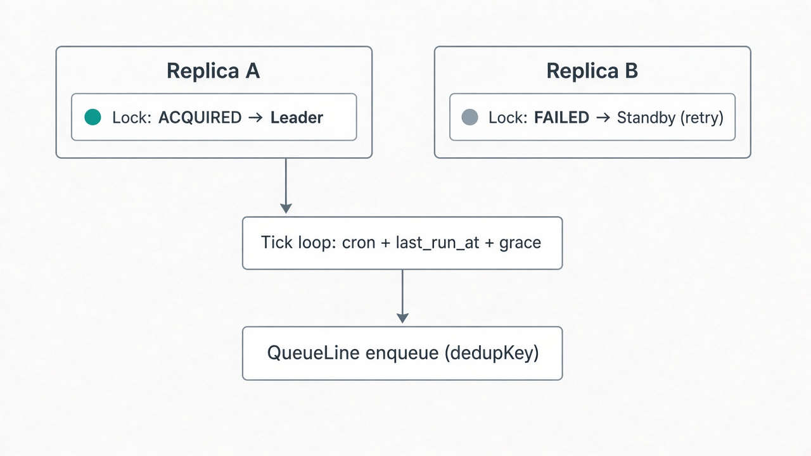
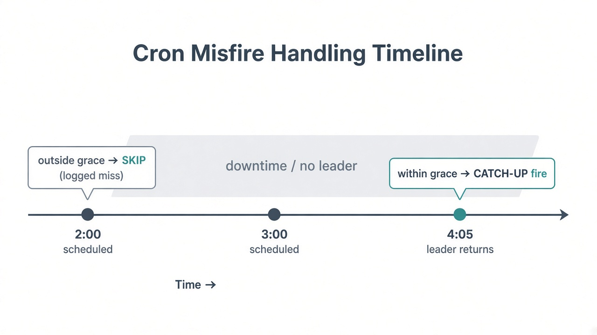
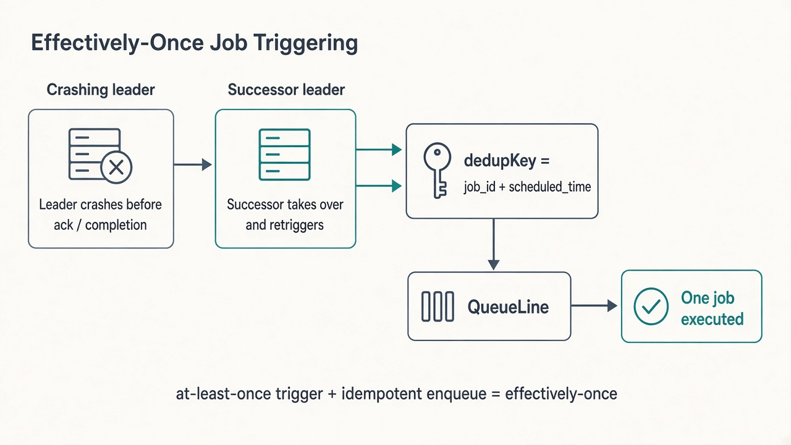

# One Lock, Automatically Released — Leader Election Without a Cleanup Step

**Publishing notes (delete before posting on Medium):**
- Upload the four images from `docs/images/` into Medium’s editor where the
  markdown image references appear below.
- Suggested tags: `Distributed Systems`, `PostgreSQL`, `Go`, `Backend`,
  `System Design`
- Replace `<your-repo-url>` with your public repo link.

---



Leader election shows up constantly in system design interviews and almost
never in actual portfolios, because it sounds like it requires implementing
Raft from a whiteboard diagram.

It doesn’t — if the problem you actually have is “exactly one of my N
replicas should decide when to run this scheduled job,” rather than
“coordinate consensus across an arbitrary distributed system.”

That narrower problem is what **CronMesh** solves: a distributed cron
service in Go on PostgreSQL, where leadership is a session-level advisory
lock, failover is a TCP connection dying, and “exactly-once” is an honest
claim you only get by pairing leader election with idempotent triggering.

This is Project 18 in a backend roadmap. It’s deliberately paired with an
earlier project — **PyDataRex** — that solves the *same* leader-election
question with a *different* mechanism. The interesting part isn’t either
mechanism alone. It’s knowing which one fits which deployment shape.

## The problem with N replicas and a clock

Run five copies of a cron service for availability and, by default, you get
five independent clocks. Not necessarily five duplicate executions
(downstream systems might absorb that), but five replicas doing redundant,
uncoordinated scheduling work — and no clean answer to “which one actually
owns this tick?”

You need exactly one scheduler. When that one dies, another must take over
immediately. Ideally without a lease timer, a cleanup job, or a handoff
protocol you have to get right under failure.

## The mechanism: `pg_try_advisory_lock`

Postgres already has a primitive built for this:
`pg_try_advisory_lock(key)`.

It’s a named lock scoped to a database *session*. The attempt is
non-blocking — it returns true or false. Exactly one session can hold a
given key at a time. And — the detail that makes it elegant for this use
case — Postgres releases the lock the instant that session’s connection
closes, for any reason, including a hard crash with no graceful shutdown.

Failover isn’t something you build. It falls out of a normal TCP connection
dying.



Every CronMesh replica opens one dedicated, long-lived, deliberately
**unpooled** connection purely to hold this lock. Only the replica that
acquires it runs the scheduling tick loop. The others retry the
non-blocking acquisition on a timer, costing almost nothing while they wait,
and take over as soon as the current leader’s connection drops.

No lease to expire. No manual handoff. No cleanup step. The lock’s lifetime
*is* the connection’s lifetime, guaranteed by Postgres itself.

## Why this is different from PyDataRex (and why that matters)

PyDataRex solves the same leadership problem with a lease row and a
conditional `UPDATE`:

```sql
UPDATE scheduler_leader
SET leader_id = :self_id,
    lease_expires_at = now() + make_interval(secs => :lease_duration)
WHERE leader_id = :self_id OR lease_expires_at < now();
```

That choice is deliberate. Session-level advisory locks require a
session-pinned connection. They’re incompatible with connection poolers in
transaction-pooling mode — PgBouncer’s most common production setup — which
is exactly what a typical web-facing app uses for everything else.

PyDataRex’s scheduler runs *alongside* an API that wants pooled connections.
CronMesh is a different kind of service: a small, dedicated, always-on
background process whose entire job is holding one lock and ticking a clock.
Reserving one long-lived unpooled connection isn’t a tradeoff there. It’s
simply appropriate.

Two valid answers. Two different deployment shapes. The skill worth
practicing is naming both and explaining the tradeoff — not memorizing one
mechanism cold.

## Misfire handling: what happens after nobody was leader

Leader election answers “exactly one replica is scheduling right now.” It
says nothing about a job whose scheduled time passed *while there was no
leader at all* — a full cluster restart, a deployment window, a crash
followed by slow failover.

A job owed runs at 2:00 and 3:00 while the system was down needs an
explicit, configured answer to “what do we do about the runs we missed?” —
not silent loss, and not an accidental pile of retroactive catch-up runs
nobody wanted.



Every CronMesh job carries a `misfire_grace_period`. When a leader ticks, it
compares each owed scheduled time against now. Inside the grace window →
fire as a catch-up run. Outside it → log an explicit miss, advance
`last_run_at`, and resume from the next naturally due tick.

A scheduler that doesn’t make this decision explicit will make it
accidentally — usually by whichever behavior falls out of how the code was
written, not by anyone’s actual intent.

## Leader election alone is not exactly-once

This is the less obvious lesson the project exists to teach.

It’s tempting to believe “only one replica is ever the leader” implies
“every job runs exactly once.” It doesn’t.

A leader can decide a job is due, begin triggering it, and crash *between*
that decision and durably recording that it happened — the classic gap
between “acted” and “remembered acting.” The new leader has no way to know
whether the previous trigger completed. The only safe assumption is that it
might not have — so it should try again rather than risk silently losing a
scheduled run.

Leader election alone gives you **at-least-once triggering**, not
exactly-once.



What closes the gap: every trigger is submitted to **QueueLine** (a job
queue built earlier in the same roadmap) with an idempotency key derived
deterministically from `(job_id, scheduled_time)`. If a handoff causes the
same scheduled run to be submitted twice, QueueLine collapses the duplicate
into a no-op.

Leader election bounds concurrent triggering. Idempotent triggering makes
the rare handoff-window duplicate harmless. Together, they deliver
**effectively-once** — a specific, defensible claim — not the stronger,
not-actually-achievable “exactly-once” that distributed-systems folklore
likes to promise.

## Deliberately not rebuilding a job queue

CronMesh’s responsibility ends at “decide a job is due, and trigger it
effectively once.” Worker pools, retries with backoff, dead-lettering —
that’s QueueLine’s job. Recognizing “I already solved this two projects ago”
is as much the skill as any individual mechanism.

## What’s out of scope

- A job-definition UI or cron builder (product surface, not the lesson).
- Sub-second scheduling (a different problem than minute-granularity cron).
- Multi-region leader election (v1 assumes one Postgres reachable by every
  replica; Raft is a separate project).

## Closing

Building the same distributed-systems problem twice, with two different
both-correct mechanisms chosen for two different reasons, teaches something
a single implementation can’t: “how do you do leader election?” doesn’t have
one right answer. It has a right answer *for a given deployment shape*.

Pair that with the honest detail that leader election by itself doesn’t
deliver exactly-once execution — only leader election *plus* idempotent
triggering does — and a small project covers more real ground than its size
suggests.

**Open source:** <your-repo-url>
